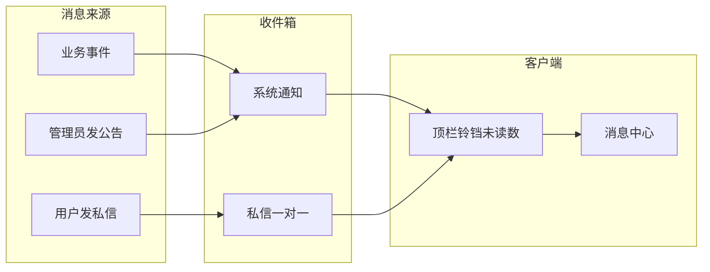
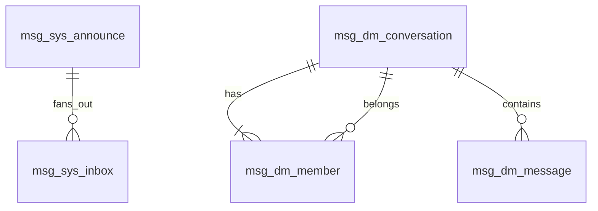

# MMS 消息系统 · 功能设计

> 状态：**V1 已落地**（2026-08-04 与代码对齐回补）  
> 仓库：本体 `MyManagementSystem-Backend`（`mms-usercenter-bc`）；前端 `MyManagementSystem-Web`。  
> 配套原型：`docs/消息系统页面原型.html`（入口）+ 管理员 / 普通用户消息中心 + **公告管理**。  
> **真源优先级**：实现行为以代码为准；本文与原型冲突时以代码回补本文。

## 1. 背景

MMS 已有 WebSocket 推送与在线用户实时能力，但**没有**站内信 / 通知收件箱产品。  
MMS 是后台管理（RBAC、组织、作业、审计），不是社交 IM。

**推荐形态：站内信（Inbox），不要按微信做。**  
目标是「能发、能收、能看见系统提示」，不是连续刷屏聊天。

## 2. 产品定位

站内信 = **可持久、可已读** 的消息；实时只负责「有新消息」提醒。



### 体验原则

1. **可靠优先于实时**：先保证落库能查，再保证铃铛响。
2. **系统与私信分栏**：一眼分清「系统在说」和「人在说」。
3. **克制聊天感**：后台里「交代一句」用私信即可。

## 3. 两类消息（V1 只做这两类）

### 3.1 系统通知（System）

| 维度 | 说明 |
|------|------|
| 谁发 | 系统（业务事件）或有权限的管理员 |
| 谁收 | 指定用户；或全员 / 按角色广播后展开为每人一条 |
| 可否回复 | 不可回复 |
| 特点 | 富文本公告 / 纯文本业务通知 |
| 列表操作 | **收藏**（不参与默认排序，见 §4.6） |
| 例子 | 作业失败、账号禁用、维护公告 |

### 3.2 用户私信（Private · 一对一会话）

| 维度 | 说明 |
|------|------|
| 形态 | **会话列表**（一人一行），不是带标题的邮件收件 |
| 谁发 / 谁收 | 登录用户 ↔ 另一系统用户 |
| 列表展示 | **对方昵称** + 头像 + 最近一条预览；**无消息标题** |
| 发起方式 | 「找人」搜同事 → 打开会话（组织内发起沟通，**不是加好友**） |
| 可否回复 | 可回复（同一会话；详情为气泡往来） |
| 内容 | 纯文本 |
| 列表操作 | **不显示** / **删除** / **置顶**（见 §4.5） |
| 例子 | 跟同事交代权限、对齐口径 |

### 3.3 建议近期不做

- 群聊、频道、@、表情贴纸、音视频
- 已读回执到秒级、**私信**限时撤回（可放后续；与「公告撤回」不同）
- 短信 / 邮件 / 企微外推（另开通道，不是站内信本体）
- 业务页「一键跳转」链接（V1 不做跳转字段）

## 4. 用户能感知到的功能

### 4.1 全局入口

- 布局顶栏增加**铃铛**：未读总数角标；下拉最近几条 +「查看全部」（**主入口**）
- 独立「消息中心」页：
  - Tab：**系统 / 私信**（不做「全部」混排）
  - 列表区：① 迷你搜索；② 操作行（全部已读；管理员另有发系统公告；系统 Tab 另有**收藏**筛选项）
  - **找人「+」仅在私信 Tab 显示**（系统 Tab 不出现）
  - 列表行：头像 + 姓名（无时间）
    - **系统**：右侧直接一枚**收藏星星**（空心/实心切换），无三点菜单
    - **私信**：右侧三点菜单（不显示 / 删除 / 置顶）
  - 详情：头像 + 姓名；气泡内不显时间；**间隔 ≥ 5 分钟**在聊天中央显示时间（类微信）；系统通知正文上方居中时间
  - 找人 / 回复：**静默**打开或发送，不弹成功 Toast；软操作（不显示 / 置顶 / 已读）用 Toast；收藏靠星星图标态反馈，可不弹 Toast
- **菜单归属（收件箱）**：独立**顶层单菜单**（与「首页」同级，不套空目录），**不要**挂在「系统管理」下；菜单码 `MESSAGE_CENTER`
- **发公告快捷入口**：消息中心操作行「发系统公告」**保留**（与公告管理页共用同一套发公告能力）

### 4.1.1 公告管理（系统管理子菜单 · V1）

挂在 **系统管理 → 公告管理**（不是消息中心的一部分）。  
面向：持有公告相关权限的角色（菜单码 `MESSAGE_ANNOUNCE`，按钮细码见 §4.7；按权限不按写死角色名）。

| 能力 | 说明 |
|------|------|
| 公告列表 | 对齐系统管理 CRUD：查询区 + 操作栏 + 表格（含序号、**操作列**）+ 分页；点**标题**进入详情 |
| 列表操作 | **修改** / **撤回** / **删除**（按行状态启用/禁用） |
| 公告详情 | **同页切换**（非抽屉）：左上角「返回」；已读/未读名单支持**搜索 + 分页 + 区内滚动**；已撤回展示提示条 |
| 公告状态文案 | 界面：发送中 / 已发送 / 失败 / **已撤回**（库值 `0~4`；`0/1` 均显示发送中） |
| 发公告 / 修改 | 本页可发；弹窗与消息中心「发系统公告」**同一套**（宽弹窗 + Quill）。**同步扇出**：接口等写完收件箱再返回（人多时前端转圈）。修改只改标题与正文，**不改发送范围**；同步更新已扇出 inbox，**重置为未读**并推未读校准；仅已发送/失败可改 |
| 撤回 | 软删收件箱，状态置 **已撤回(4)**；用户消息中心不再显示 |
| 删除 | 发件记录逻辑删除 + 收件箱软删 |
| 一键提醒未读 | **不做**（V1） |
| 与收件箱关系 | 管理端看「发出的公告」；个人消息中心系统 Tab 仍是「收到的通知」 |

数据来源：`msg_sys_announce` + 聚合 `msg_sys_inbox.read_flag`（无需另建已读表）。

### 4.2 找人 / 私信会话

- 仅私信 Tab 圆形「+」→「找人」弹窗：搜索姓名 / 用户名 / 部门 → 点选同事
- 找人接口：`POST /msg/dm/user/search`，权限 **`MESSAGE_SEND_PRIVATE`**（不依赖用户管理 `SYSTEM_USER_VIEW`）；只返回启用用户轻量字段，并排除自己
- 点选后**直接打开**该人对话框；无成功 Toast
- 已有会话且曾「不显示」→ **取消隐藏并打开原会话（历史仍在）**
- 已删除（自己侧）后再找人 → **对当前用户表现为新的空会话**（见 §4.5、§10）
- **不是加好友**；私信**不设标题**；列表主文案 = **对方昵称**

### 4.3 系统通知怎么产生

- **业务自动发**：内部接口 POST /internal/msg/sys/notify（白名单 /internal/msg/**）→ 写 msg_sys_inbox（nnounce_id 空，填 iz_type/iz_id）→ 推未读；**不进公告管理**。示例：FINANCE_RECURRING_DUE（记账快捷模板到期）。
- **人工发公告**：有权限的人写公告 → 选范围（全员 / 角色 / 指定人）→ 落成多人系统通知；正文用**富文本**（复用现有 `QuillEditor`；原型弹窗约 1200px 宽、编辑区高度约 480px，落地以组件默认高度为准，可配置）

### 4.3.1 正文形态

| 场景 | 形态 | 原因 |
|------|------|------|
| 私信 / 回复 | 纯文本 | 会话内短沟通即可；XSS/存储简单 |
| 管理员发系统公告 | 富文本（Quill） | 公告常有标题层级、列表、加粗、链接；项目已有组件 |
| 业务自动系统通知 | 纯文本模板 | 程序生成，不需要编辑器 |

### 4.4 已读与未读

- 默认未读；打开详情或「全部已读」→ 已读
- 未读数驱动铃铛；在线时用现有 WebSocket **只推未读变化 / 有新消息信号**；完整内容打开收件箱再 HTTP 拉
- 离线用户下次登录拉取未读数
- 第一版不强调「对方是否已读你的私信」

### 4.5 不显示 vs 删除（已拍板）

| 操作 | 作用 | 记录 | 再次找人 |
|------|------|------|----------|
| **不显示** | 仅从自己的私信列表**暂时**隐藏 | **不删**聊天记录 | 打开**同一会话**，历史仍可见 |
| **删除** | 从自己侧移除会话入口，并清除自己侧可见的聊天记录 | 对方侧不受影响 | 对当前用户表现为**空会话**（可再聊） |

- **对方发来新消息** → 自动取消隐藏、记未读并重新出现在列表（不显示 ≠ 免打扰永久屏蔽）
- 删除前弹出**确认框**（复用项目已有确认组件；原型为 `confirmDialog`）
- 不显示 / 置顶：Toast，无需确认

### 4.6 收藏与排序（已拍板）

**收藏（仅系统通知）**

- 列表行右侧**星星图标**：空心 = 未收藏，点击变实心 = 已收藏，再点还原（无三点菜单）
- **不参与默认排序**（收藏不会把条目抬到列表最前）
- **单独筛选**：系统 Tab 操作行「收藏」chip；点亮后**仅显示已收藏**；再点取消；无收藏时空态「暂无收藏」
- 切到私信 Tab 时自动关闭收藏筛选

**排序规则**

| Tab | 默认排序 |
|-----|----------|
| 私信 | **置顶** > **未读** > 时间倒序 |
| 系统 | **未读** > 时间倒序（收藏不抬升） |

打开详情变为已读后**暂不挪动位置**（切 Tab / 搜索 / 切换收藏筛 / 全部已读时再重排）。

### 4.7 权限边界

| 能力 | 谁 |
|------|-----|
| 看自己的收件箱、找人开会话、回私信、标已读、不显示 / 删自己侧会话、收藏系统通知 | 持消息中心按钮权限的登录用户 |
| 公告管理（列表 / 详情 / 已读统计）与发 / 改 / 撤 / 删 | 持对应 `MESSAGE_ANNOUNCE_*` 按钮权限 |
| 冒充系统发「系统通知」 | 禁止普通用户（仅公告管理链路） |

权限码（与 `PermissionConstants` / 库表一致）：

**消息中心**

- `MESSAGE_CENTER`（顶层菜单；旧目录码 `MESSAGE` 已废弃）
- `MESSAGE_VIEW` / `MESSAGE_SEND_PRIVATE` / `MESSAGE_READ` / `MESSAGE_DELETE`

**公告管理**

- `MESSAGE_ANNOUNCE`（菜单）
- `MESSAGE_ANNOUNCE_VIEW`（查看 / 名单）
- `MESSAGE_ANNOUNCE_CREATE`（发布）
- `MESSAGE_ANNOUNCE_UPDATE`（修改）
- `MESSAGE_ANNOUNCE_RECALL`（撤回）
- `MESSAGE_ANNOUNCE_DELETE`（删除）

## 5. 建议分期

### V1

| 编号 | 功能 |
|------|------|
| F01 | 顶栏铃铛 + 未读角标 |
| F02 | 铃铛下拉最近消息 + 查看全部 |
| F03 | 消息中心页（Tab：系统 / 私信） |
| F04 | 列表分页 + 迷你搜索 |
| F05 | 未读优先排序；打开已读后暂不重排 |
| F06 | 详情（系统正文 / 私信气泡往来） |
| F07 | 标记已读、全部已读 |
| F08 | 系统通知删除（自己侧）；私信删除（确认框 + 自己侧清记录） |
| F09 | 私信不显示 / 置顶；系统收藏 + 收藏筛选 |
| F10 | 找人发起 / 打开私信会话（仅私信 Tab 显示「+」） |
| F11 | **公告管理**（系统管理子菜单：列表含操作列、已读/未读统计与名单；本页可发公告） |
| F12 | 发系统公告（消息中心快捷入口 + 公告管理入口；选人 / 角色 / 全员；正文富文本） |
| F13～F14 | **业务自动发系统通知**（内部 `POST /internal/msg/sys/notify` + Feign；幂等 `uk_biz_user`；不进公告管理） |
| F15～F16 | WebSocket 推未读数；登录后 HTTP 拉未读数 |
| F17 | 公告 **修改 / 撤回 / 删除**（含状态「已撤回」与细权限码） |

> 说明：原「用户管理发消息 / 业务跳转」不做；F11 现用于公告管理。  
> 注：V2「限时撤回」指**私信消息**撤回；与 F17 **公告撤回**（整份公告从收件箱移除）不是同一能力。

### V2（有需要再加）

- 私信附件、消息模板
- 免打扰 / 按类型开关
- 已读回执、私信限时撤回
- 作业失败等默认文案模板
- 「已隐藏会话」管理列表（可选；当前靠再次找人恢复）

### 明确不做（至少近期）

- 群聊、频道、朋友圈式动态
- 以 MQ 当用户邮箱（MQ 最多做异步写库/推送，用户看到的仍是收件箱）

## 6. 和现有能力的关系

- **归属 BC（已拍板）**：代码与表均在 **`mms-usercenter-bc`（用户中心服务）**；表前缀 **`msg_`**
- **身份**：每人只看自己的信 / 自己的会话成员态；公告管理按 `MESSAGE_ANNOUNCE_VIEW` 等细码看全部发件记录
- **实时**：复用已有 App 级 WebSocket，只推「未读数 / 有新消息」；完整内容打开收件箱再拉
- **富文本**：前端复用 `QuillEditor`；后端 `MsgHtmlSanitizeUtils`（jsoup）入库前净化
- **入口**：顶栏铃铛为主入口；侧栏「消息中心」做可发现性；「公告管理」挂系统管理

## 7. 验收脚本（V1）

1. 用户 A 登录 → 铃铛未读正确。
2. 管理员给 A 发公告 → A 在线则角标增加；消息中心系统 Tab 可见。
3. A 打开详情 → 自动已读，角标减少；列表位置暂不跳。
4. A 给 B 发私信 → B 私信 Tab 收到；B 回复 → A 可见气泡往来。
5. A「全部已读」→ 未读清零。
6. A「不显示」会话 → 列表消失；再找同一人 → 历史仍在；B 再发一条 → A 侧自动重新出现并未读。
7. A「删除」会话（确认后）→ 列表消失且自己侧无历史；再找同一人 → 空会话可发。
8. A 点系统行星星收藏 → 默认列表顺序不变；点「收藏」chip 仅见已收藏。
9. 系统 Tab 无「找人 +」、无三点菜单（仅星星）；切到私信 Tab 才出现「+」与三点菜单。
10. 管理员打开 **系统管理 → 公告管理** → 可见刚发公告；A 已读后已读数 +1，未读名单少 A。
11. 消息中心与公告管理均可发公告，落库为同一 `msg_sys_announce` 流程。
12. 管理员修改已完成公告正文 → A 打开详情看到新内容；撤回后 A 系统 Tab 不再显示该条；删除后发件列表消失。

## 8. 页面原型

入口：`docs/消息系统页面原型.html`。

| 文件 | 视角 | 差异要点 |
|------|------|----------|
| `消息系统页面原型-管理员.html` | 李鸿羽 · 消息中心 | 找人会话 + 发系统公告快捷入口 |
| `消息系统页面原型-普通用户.html` | 小满 · 消息中心 | 找人会话；**无**发公告 |
| `消息系统页面原型-公告管理.html` | 系统管理 · 公告管理 | CRUD 列表（含操作列：改/撤/删）；状态含已撤回；点标题进同页详情+返回；发公告弹窗与消息中心一致 |

**收藏交互（原型已实现）**

- **标记**：系统列表行右侧星星，空心/实心切换。
- **筛选**：系统 Tab → 操作行「全部已读」旁 **「收藏」chip**。
  - 默认：chip 未点亮，列表按未读 > 时间，**已收藏不因收藏上浮**。
  - 点亮：仅显示已收藏；chip 高亮；空列表文案「暂无收藏」。
  - 切到私信：chip 隐藏并复位筛选。

## 9. 实现方案（落地必想）

### 9.1 公告按角色 / 全员 → 每人一条（同步扇出）

**方案：发件记录 + 同进程同步扇出**

1. 管理员提交公告 → 先写 `msg_sys_announce`（过程态 `0 PENDING` / `1 RUNNING`；终态 `2 DONE` / `3 FAILED` / `4 RECALLED`；界面：发送中 / 已发送 / 失败 / 已撤回）。范围快照写入 JSON。
2. **同一请求内**同步按批写入 `msg_sys_inbox`（幂等 `(announce_id, user_id)`），写完再返回；前端发公告接口超时放宽。失败则标 `FAILED` 并业务报错。
3. **撤回**软删 inbox 并标 `RECALLED`；**删除**软删 inbox + 逻辑删发件。不做强制失败 / 重试。
4. 在线用户按批推 WebSocket 未读校准；扇出目标**跳过禁用用户**。

### 9.2 富文本 XSS

**方案：入库前服务端净化 + 前端安全渲染**

- 仅公告 HTML 走净化（允许标签白名单：标题、段落、列表、加粗、链接等；禁 `script` / 事件属性 / `iframe` 等）。
- 推荐复用成熟库（如 OWASP Java HTML Sanitizer / jsoup Cleaner），白名单与前端 Quill 输出对齐。
- 前端展示用 `v-html` 时只渲染已净化内容；私信始终纯文本 + 转义，不入库 HTML。

### 9.3 私信会话模型

**方案：共享会话 + 成员态（推荐）**

| 概念 | 表 | 说明 |
|------|-----|------|
| 会话 | `msg_dm_conversation` | 两人一对一，`(user_low_id, user_high_id)` 唯一 |
| 成员态 | `msg_dm_member` | 每人对该会话的隐藏 / 置顶 / 未读 / 清除游标 |
| 消息 | `msg_dm_message` | 挂在 `conversation_id` 上，双方共享正文 |

**不显示**：`msg_dm_member.hidden = 1`；消息不动。再找人 → `hidden = 0`，按原会话拉全量（受清除游标约束）。

**删除（自己侧）**：

- 设 `cleared_before_id`（或 `cleared_at`）为当前最大消息 ID / 当前时间；
- `hidden = 0` 可保留或一并隐藏；列表规则：若清除后无新消息则不出现在列表（或出现空会话由找人再建视图）；
- **不物理删** `msg_dm_message`（对方仍要看）；当前用户查询消息时加条件 `id > cleared_before_id`；
- 再次找人：复用同一 `conversation_id`，对当前用户表现为空线程，直到任一方再发新消息。

> 产品文案「开新会话」= **自己侧空视图**，不是再插一条 conversation（避免对方出现「同人双会话」）。

列表「最近一条预览 / 时间」取：当前用户可见的最新消息；未读数取可见且 `id > last_read_msg_id` 的对方消息数。

### 9.4 WebSocket 推送边界

**方案：只推信号，不推正文**

- 事件类型（实现）：`type: "msg_unread"`，`data` 为 `{ total, sysUnread, privUnread }`（常量 `MsgConstants.WS_TYPE_MSG_UNREAD`）。
- 客户端收到后更新铃铛 / Tab 角标；消息中心左侧会话列表应同步未读与预览（不整表重排）；打开详情再走 HTTP 拉正文。
- 优点：载荷小、无 XSS/隐私误推、与现有在线用户通道一致。
- 断线重连：登录或 WS 恢复后 HTTP 拉一次未读校准。

### 9.5 禁用用户

| 场景 | 规则 |
|------|------|
| 找人列表 | **不展示**禁用账号（或展示但不可选；推荐直接过滤） |
| 已有会话，对方被禁用 | 会话仍可打开看历史；**发送接口拒绝**并提示「对方账号不可用」 |
| 己方被禁用 | 登录都不可用，消息能力随之不可用 |
| 系统通知 | 扇出时跳过已禁用用户（或仍写入但对方无法登录查看——推荐跳过并记入公告任务统计） |

## 10. 库表结构（设计稿）

> 约定：表前缀 `msg_`；主键雪花；常用审计字段对齐 `BaseEntity`（`deleted` / `create_by` / `create_time` / `update_by` / `update_time`）。  
> 库：`mms_*_core`；**模块：`mms-usercenter-bc`（已拍板）**；表前缀 **`msg_`（已拍板）**。  
> 下列为逻辑设计，落地时再出正式 SQL 迁移脚本。

### 10.1 系统公告发件（管理员操作留痕）

```text
msg_sys_announce
  id                bigint PK
  title             varchar(200)      -- 公告标题
  content_html      mediumtext        -- 净化后的富文本
  content_text      varchar(500)      -- 纯文本摘要（列表预览）
  scope_type        tinyint           -- 1指定人 2角色 3全员
  scope_payload     json              -- 用户ID/角色ID列表快照
  status            tinyint           -- 0待发送 1发送中 2已完成 3失败 4已撤回（界面文案；技术过程称扇出）
  total_target      int               -- 目标人数
  success_count     int
  fail_count        int
  cursor_json       json null         -- 扇出进度（可选）
  error_msg         varchar(500) null
  deleted / create_by / create_time / update_by / update_time
```

索引：`idx_status_ctime (status, create_time)`。

### 10.2 系统通知收件箱（每人一条）

```text
msg_sys_inbox
  id                bigint PK
  user_id           bigint            -- 收件人
  announce_id       bigint null       -- 来自人工公告；业务通知可空
  biz_type          varchar(64) null  -- 如 JOB_FAIL / SECURITY / ANNOUNCE
  biz_id            varchar(64) null  -- 业务侧关联（可选，不做跳转也可留空）
  title             varchar(200)
  content_html      mediumtext null   -- 公告用；业务通知可空
  content_text      varchar(2000)     -- 纯文本或摘要
  starred           tinyint default 0
  read_flag         tinyint default 0 -- 0未读 1已读
  read_time         datetime null
  deleted / create_by / create_time / update_by / update_time
```

索引：

- `uk_announce_user (announce_id, user_id)`（公告扇出幂等）
- `uk_biz_user (biz_type, biz_id, user_id)`（业务通知幂等；业务通知须填非空 `biz_type`/`biz_id`）
- `idx_user_list (user_id, deleted, read_flag, create_time)`
- `idx_user_star (user_id, deleted, starred, create_time)`

列表默认：`deleted=0`，按 `read_flag ASC, create_time DESC`；收藏筛：`starred=1`。

### 10.3 私信会话

```text
msg_dm_conversation
  id                bigint PK
  user_low_id       bigint            -- min(双方用户ID)
  user_high_id      bigint            -- max(双方用户ID)
  last_msg_id       bigint null
  last_msg_time     datetime null
  deleted / create_by / create_time / update_by / update_time
```

唯一索引：`uk_pair (user_low_id, user_high_id)`。

### 10.4 私信成员态（每用户每会话一行）

```text
msg_dm_member
  id                bigint PK
  conversation_id   bigint
  user_id           bigint
  peer_id           bigint            -- 冗余对方，方便列表
  hidden            tinyint default 0 -- 不显示
  pinned            tinyint default 0
  pinned_time       datetime null
  unread_count      int default 0
  last_read_msg_id  bigint default 0
  cleared_before_id bigint default 0  -- 删除：自己侧只看 id > 此值的消息
  last_msg_id       bigint null       -- 自己可见的最新消息（可冗余）
  last_msg_preview  varchar(200) null
  last_msg_time     datetime null
  deleted / create_by / create_time / update_by / update_time
```

唯一索引：`uk_conv_user (conversation_id, user_id)`  
列表索引：`idx_user_inbox (user_id, deleted, hidden, pinned, last_msg_time)`

**不显示**：`hidden=1`。  
**删除**：更新 `cleared_before_id`、清空预览/未读，并从列表查询条件中排除（无可见新消息且未主动找人打开时可视为不展示）；**不**删对方 `msg_dm_member` 与历史消息行。

### 10.5 私信消息

```text
msg_dm_message
  id                bigint PK
  conversation_id   bigint
  sender_id         bigint
  content           varchar(2000)     -- 纯文本
  deleted / create_by / create_time / update_by / update_time
```

索引：`idx_conv_id (conversation_id, id)`。

发送流程简述：校验双方未禁用 → 取或建 conversation → 插 message → 更新双方 member 的预览/未读（接收方 `unread_count++`）；**若接收方 `hidden=1`，写入时强制 `hidden=0` 并记未读**（已拍板：不显示只是暂时不显示，对方来信必须重新出现）。再次找人是「无新消息时」找回历史的路径。

### 10.6（可选）扇出任务明细

若需可观测重试，可加：

```text
msg_sys_announce_task
  id, announce_id, user_id, status, retry_count, error_msg, ...
  uk (announce_id, user_id)
```

小流量也可只靠 `msg_sys_announce.cursor_json` + 直接写 inbox，不建明细表。

### 10.7 ER 关系（简图）



## 11. 已拍板摘要

| 项 | 结论 |
|----|------|
| 产品形态 | 站内信 = 系统通知 + 一对一私信，不做群聊 |
| 服务与表 | 代码写在 **usercenter**；表前缀 **`msg_`** |
| 不显示 | 暂时隐藏；对方来信自动再显示；也可再次找人打开 |
| 系统收藏 | 行内星星 +「收藏」chip 筛选；不参与默认排序 |
| 发公告入口 | 消息中心快捷 **保留**；另有系统管理 → **公告管理** |
| 公告管理 | **进 V1**：列表含操作列（改/撤/删）；点标题进详情；已读/未读名单搜索+分页；状态含「已撤回」；**不做**一键催读 |
| WS 事件 | `msg_unread`（小写），只推未读聚合 |
| 扇出实现 | 同步扇出写完再返回；跳过禁用用户 |
| 业务系统通知 | 内部接口 `/internal/msg/sys/notify`（白名单）；`MsgBizNotifyFeign`；幂等 `(biz_type,biz_id,user_id)`；不写 `msg_sys_announce` |

### 仍可后续再定

- 多实例部署时是否改回 MQ 主通道扇出
- 作业失败等更多 `biz_type` 接入点

### 正式环境增量脚本

1. `mysql/prod/20260803_2300_msg_inbox_and_permission.sql`（建表 + 消息/公告基础权限）
2. `mysql/prod/20260804_1750_announce_update_recall_delete_permission.sql`（公告修改/撤回/删除权限 + `status` 注释含已撤回）
3. `mysql/prod/20260804_2315_flatten_message_center_menu.sql`（消息中心去掉空壳目录，提升为顶层单菜单）
4. `mysql/prod/20260806_1540_finance_recurring_remind_and_biz_notify.sql`（`uk_biz_user` + 模板提醒时刻 + `FINANCE_RECURRING_REMIND` Job；本地 `_local.sql`）

本地库可将脚本内 `USE` 改为 `mms_dev_core`；全新库以 `mysql/init_mms_dev_core.sql` / `mysql/prod/init_mms_prod_core.sql` 为准。
