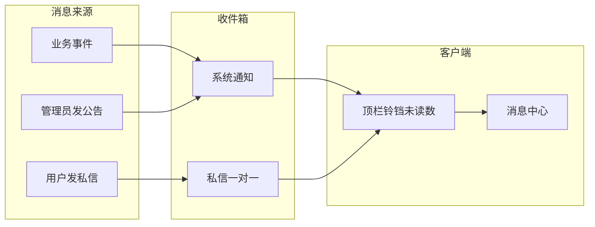

# MMS 消息系统 · 功能设计（产品层）

> 状态：方案讨论稿（2026-08-03）  
> 说明：仅功能/产品设计，不含库表与接口实现细节。  
> 仓库：本体 `MyManagementSystem-Backend`；是否落地待定。

## 1. 背景

MMS 已有 WebSocket 推送与在线用户实时能力，但**没有**站内信 / 通知收件箱产品。  
MMS 是后台管理（RBAC、组织、作业、审计），不是社交 IM。

**推荐形态：站内信（Inbox），不要按微信做。**  
目标是「能发、能收、能看见系统提示」，不是连续刷屏聊天。

## 2. 产品定位

站内信 = **可持久、可已读、可跳转业务** 的消息；实时只负责「有新消息」提醒。

### 体验原则

1. **可靠优先于实时**：先保证落库能查，再保证铃铛响。
2. **系统与私信分栏**：一眼分清「系统在说」和「人在说」。
3. **能点到业务**：系统通知尽量带跳转，否则只是噪音。
4. **克制聊天感**：后台里「交代一句」用私信即可。

## 3. 两类消息（建议第一版只做这两类）

### 3.1 系统通知（System）

| 维度 | 说明 |
|------|------|
| 谁发 | 系统（业务事件）或有权限的管理员 |
| 谁收 | 指定用户；或全员 / 按角色广播后展开为每人一条 |
| 可否回复 | 不可回复 |
| 特点 | 可带业务跳转（如作业日志页） |
| 例子 | 作业失败、账号禁用、维护公告 |

### 3.2 用户私信（Private · 一对一）

| 维度 | 说明 |
|------|------|
| 谁发 / 谁收 | 登录用户 → 另一系统用户 |
| 可否回复 | 可回复（同一会话线程） |
| 内容 | 第一版简单文本即可 |
| 例子 | 管理员提醒处理权限、同事简短工作交代 |

### 3.3 建议近期不做

- 群聊、频道、@、表情贴纸、音视频
- 已读回执到秒级、限时撤回（可放后续）
- 短信 / 邮件 / 企微外推（另开通道，不是站内信本体）

## 4. 用户能感知到的功能

### 4.1 全局入口

- 布局顶栏增加**铃铛**：未读总数角标；下拉最近几条 +「查看全部」
- 独立「消息中心」页（或右侧抽屉）：
  - Tab：全部 / 系统 / 私信
  - 筛选：未读、已读
  - 操作：标记已读、删除（仅对自己收件消失）、有跳转则点进业务页

### 4.2 发私信

- 消息中心「写私信」，或用户列表「发消息」
- 选接收人、标题（可选）、正文
- 发送后双方会话里都能看到

### 4.3 系统通知怎么产生

- **业务自动发**：作业失败、关键安全事件 → 写系统通知给相关人
- **人工发公告**：有权限的人写公告 → 选范围（全员 / 角色 / 指定人）→ 落成多人系统通知

### 4.4 已读与未读

- 默认未读；打开详情或「全部已读」→ 已读
- 未读数驱动铃铛；在线时用现有 WebSocket 推未读变化；离线用户下次登录拉取
- 第一版不强调「对方是否已读你的私信」

### 4.5 权限边界（建议）

| 能力 | 谁 |
|------|-----|
| 看自己的收件箱、发私信、标已读、删自己收件 | 登录用户 |
| 发系统公告（选人 / 角色 / 全员） | 管理员类角色 |
| 冒充系统发「系统通知」 | 禁止普通用户 |

建议权限码（实现时再定名亦可）：

- `MESSAGE`（菜单）
- `MESSAGE_VIEW` / `MESSAGE_SEND_PRIVATE` / `MESSAGE_READ` / `MESSAGE_DELETE`
- `MESSAGE_ANNOUNCE`（仅管理员）

## 5. 建议分期

### V1（若决定做，建议先做这些）

| 编号 | 功能 |
|------|------|
| F01 | 顶栏铃铛 + 未读角标 |
| F02 | 铃铛下拉最近消息 + 查看全部 |
| F03 | 消息中心页（Tab：全部 / 系统 / 私信） |
| F04～F09 | 列表分页、已读筛选、详情、标记已读、全部已读、删除（仅自己） |
| F10～F11 | 写私信；用户管理「发消息」预填接收人 |
| F12 | 管理员发系统公告（选人 / 角色 / 全员） |
| F13～F14 | 预留业务自动发系统通知；系统通知可带跳转 |
| F15～F16 | WebSocket 推未读数；登录后 HTTP 拉未读数 |

### V2（有需要再加）

- 私信气泡会话视图、附件、消息模板
- 免打扰 / 按类型开关
- 已读回执、限时撤回
- 作业失败等默认文案模板

### 明确不做（至少近期）

- 群聊、频道、朋友圈式动态
- 以 MQ 当用户邮箱（MQ 最多做异步写库/推送，用户看到的仍是收件箱）

## 6. 和现有能力的关系（功能衔接）

- **身份**：挂在 usercenter 用户上，每人只看自己的信
- **实时**：复用已有 App 级 WebSocket，只推「未读数 / 有新消息」；完整内容打开收件箱再拉
- **入口**：顶栏铃铛为主入口；作业 / 安全等页后续可挂「一键发系统通知」

## 7. 验收脚本（若落地 V1）

1. 用户 A 登录 → 铃铛未读正确。
2. 管理员给 A 发公告 → A 在线则角标增加；消息中心系统 Tab 可见。
3. A 打开详情 → 自动已读，角标减少；有跳转可进业务页。
4. A 给 B 发私信 → B 私信 Tab 收到；B 回复 → A 可见。
5. A「全部已读」→ 未读清零。
6. A 删除一条 → 仅 A 侧消失。

## 8. 待拍板

是否按本文落地：**站内信（系统通知 + 一对一私信），不做群聊**。  
若更倾向「真·即时会话为主」，产品形态与分期需重排。
